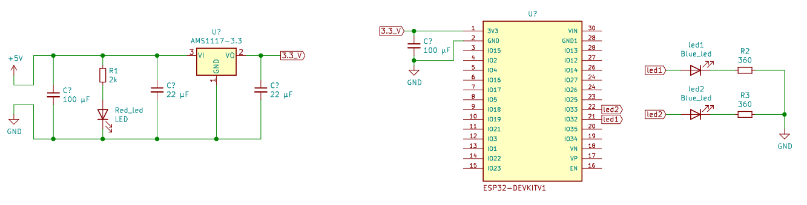

# Http Server

### Demonstração

Para mostrar o funcionamento do sistema foi criado um berve vídeo mostrando a interação do sistema com o usuário: [Web Server para Automação com ESP32 ](https://www.youtube.com/watch?v=8yiR9su6jWE "Web Server para Automação com ESP32 ")

### Resumo

Este projeto é extremamente parecido com o [Projeto 06](https://github.com/Zebio/ESP32-Projeto06-Web-Server) , a única diferença é que seu software foi feito

Usando o Framework nativo do ESP32, o ESP SDK IDF usando as funções nativas escritas em linguagem C, ao invés do Framework Arduíno usado no projeto 06.

Este projeto implementa um server que pode ser usado para automação, seja industrial ou residencial

Podemos controlar as saídas por qualquer navegador na mesma rede. O IP do ESP é imprimido na Porta Serial

### Como Usar

Para clonar esse projeto e outros do platformIO, siga o guia passo-a-passo disponível no repositório: [Instrucoes-PlatformIO](https://github.com/Zebio/Instrucoes-PlatformIO)

### Esquemático do Hardware 

Neste projeto tivemos um problema com a alimentação, pois ao usar a função "WiFi.begin(ssid, password)"
a antena de 2.4 GHz é acionada e nesse instante o dispositivo consome muita corrente. Se a alimentação não estiver boa,
a tensão de pode cair e consequentemente ativar o brownout reset do dispositivo, o reiniciando.

Para resolver isso usamos um módulo externo para alimentação, usando o AMS1117, os corretos valores dos capacitores de 
desacoplamento e uma boa fonte conseguimos uma alimentação eficiente. Podemos ver na imagem o esquemático:

### Software

O código foi escrito no VSCode, com auxílio da Extensão [PlatformIO](https://docs.platformio.org/en/latest/integration/ide/vscode.html). 
Usando Framework ESP SDK IDF e a Placa ESP32 DEV module.

